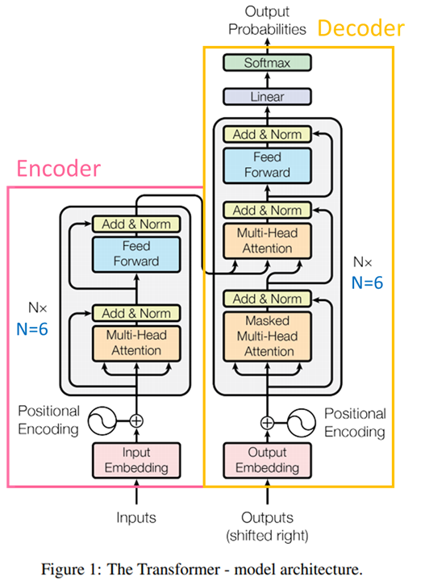
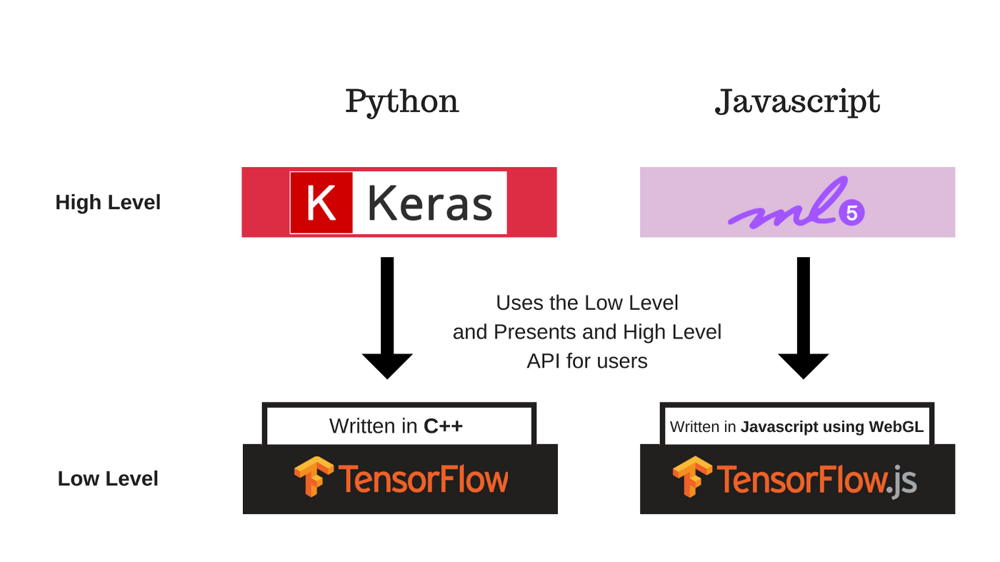
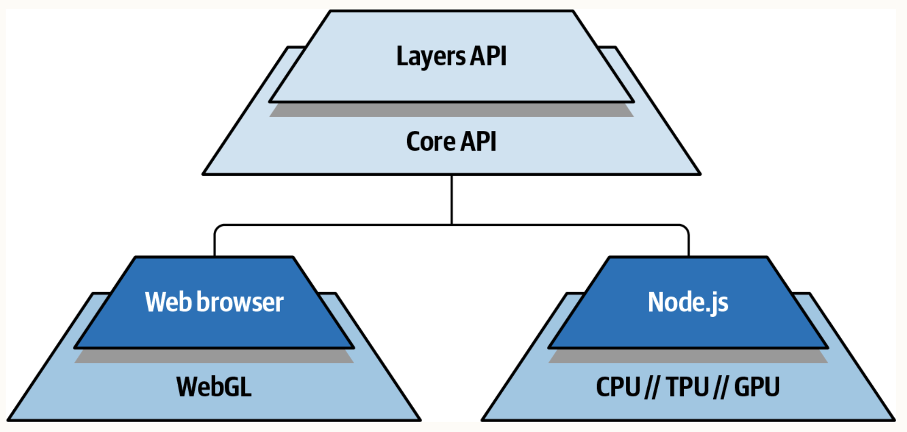

<style>
  header { 
    position: absolute; 
    left: 1000px;
  }
</style>

<style>
blockquote {
    border-top: 0.1em dashed #555;
    font-size: 60%;
    margin-top: auto;
}
</style>

<!-- _backgroundColor: lightgreen -->

# Week 13

## Machine learning/NLP in Javascript (with TensorFlow.js)


## 謝舒凱 台大語言所

---

# NLP, ML and Web Applications

---

# 回到課程的核心動機

Web applications with NLP: making the web smarter (`NLP-aware`)

---

# NLP, AI and Web Applications

- 語音辨識
- 自然語言處理
- 視覺辨識
- 搜尋
- 遊戲
- 聊天機器人
- 規劃排程

---

# 機器學習與深度學習


---

# 基本概念

- 機器學習 (Machine Learning, ML) performs tasks based on data rather than explicit (coded) rules.

- 深度學習 (Deep Learning, DL) is a subset of ML that uses neural networks to learn from data.

- 典型的 ML 任務包括分類 (classification)、回歸 (regression)、聚類 (clustering)、降維 (dimensionality reduction)、推薦系統 (recommendation system) 等。

---

# 機器學習的類型日新月異

- supervised learning

- unsupervised learning

- reinforcement learning

- semi-supervised learning

- active learning

- transfer learning

- multi-task learning

- self-supervised learning

---

- 我們在這門課的重點不是學習**開發**機器學習，而是如何在網頁設計上**使用與部署**機器學習模型。只要有很基本的概念即可。

  - Traing and testing data： train the model which works well for the training data but not for the (unseen) testing data.
  
  - 過度擬合 (overfitting)

  - Loss function
    - a function that measures how well the model performs on the training data.


<!-- 圖示 v3: 5:18-->

<!-- 3:7:34 -->

---

# 深度學習

- 深度學習是一種晚近的機器學習方法，它使用**多層**神經網路來模擬人類大腦的神經網路，並且使用大量的資料來訓練模型。

  - feed in input and produce output.
  - can be trained via `backpropagation` to improve the model.

- Configutation matters!

---

## Lab:

[Tensorflow playgound](https://playground.tensorflow.org/)

---

# Transformer
改變了之前DNN的架構，引入 Attention Mechanism，強化了 Encoder-Decoder 架構，使得模型可以更有效的處理長序列的資料。




---

# 目前大廠的主要機器學習框架

- [TensorFlow] Google 開發的開源機器學習框架 (2015-)

  - 大家常聽到的 [Keras](https://keras.io/) 則是架構在 Tensorflow 上的一個高階函式庫。

- [PyTorch] Facebook 開發的開源機器學習框架 (2016-)


---
# TensorFlow

- **Tensor+FLow**：輸入/輸出的運算資料是多維度的數值資料（張量，`Tensor`)

- 而建立的模型需要一種稱為計算圖 (computational graphs) 的流程圖來描述訓練過程的數值運算操作。張量經過這些流程 `Flow` 的數值運算後得到模型的輸出。
  <!-- - TensorFlow is simply referring to the flow of the Tensors in the computational graph. -->


---
### 當然我們可以使用 python 或 javascript 搭配 TF 機器學習框架來開發模型。

- `python - TensorFlow - CUDA/cuDNN - GPU`

- `javascript - TensorFlow.js - Eigen - CPU` 


---

# 讓前端也可以做機器學習 ｜ In-browser ML/NLP

- [Tensorflow.js]() (2018-): Machine Learning library for JavaScript, which makes ML in the browser possible.[*] 也部分支援了 `Keras`。

- 可以充分利用裝置 (e.g., camera, microphone, etc.)、 使用者互動、保護用戶隱私等優勢。

- 讓 JS 前端工程師完全不用設定環境，只要有瀏覽器即可直接使用 ML 模型 (也可以 import Python 模型)

> [*] can also use it with `node.js` for server side or backend development.


---

# 效能考量


- `Tensorflow.js` 是在瀏覽器中執行的，所以效能會受到瀏覽器限制。但現在的瀏覽器已經足夠強大，可以執行複雜的模型。(**uses GPU in web browser**)

- Frontend (browser) or backend (node.js) development

 <!-- for js developer -->


---

# WebGL optimizations


- WebGL is a JavaScript API for rendering interactive 3D and 2D graphics within any compatible web browser without the use of plug-ins. check [this website](https://get.webgl.org/)

- used by `Tensorflow.js` to run on GPU (not used for visial graphics)

<!-- Graphic cars (GPU) is faster than CPU for matrix operations -->
<!-- tf.getbackend() -->

> `TensorFlow.js`也支援 WebGL，因此即使在瀏覽器上，我們也能使用 GPU 來加快運算結果，較不用擔心在瀏覽器上的效能限制。
---

# 更高階的架構也有

- [ml5.js](https://ml5js.org/): 開源友善的架在 `TensorFlow.js` 之上。,

<!-- 舉例：https://julienrioux.medium.com/in-browser-ml-with-react-js-and-ml5-js-f3eeb5149404 -->




---
# ！我不熟悉開發 ML，怎麼做期末專案？  

- `Tensorflow.js` 提供了一些[預先訓練好的模型](https://www.tensorflow.org/js/models?hl=zh-tw)，可立即用於專案。（可惜目前 NLP 相關的還不多）

- 但，要跑 transformer-based 深度學習模型，可以直接拉 `Huggingface inference API` (下週主題)


---
# 兩種方式安裝與執行 `tensorflow.js`


- (in the **browser**) using the script tag.
- (for **node.js**) installation from NPM.

```bash
npm install @tensorflow/tfjs
# or
yarn add @tensorflow/tfjs
```

如此可在本地端執行。

```js
import * as tf from "@tensorflow/tfjs";
```

> optimizations in each environment are different.

---

# 我們先用 script tag 的方式

- Create a simple HTML file (e.g., `playground.html`), add this script tag to the HTML file: (check [the latest](https://www.tensorflow.org/js/tutorials/setup#installation_from_npm))

```html
<script src="https://cdn.jsdelivr.net/npm/@tensorflow/tfjs@2.0.0/dist/tf.min.js"></script>
```

- Open the web console.
  - Run `tf.version` in the console to verify TensorFlow is setup and see which version is running.

---

## 測試一下

- 複製該網站上的 code sampe for script tag setup 程式碼到 HTML 檔案中，並且開啟瀏覽器的 console。

- 應該會得到類似以下結果：

```html
Tensor [[6.9452119],]
```


---

# 核心概念

張量、運算子、模型、層，以及訓練、記憶體管理方法，以及如何寫出簡潔（tidy）的程式碼。

[擅用 tensorflow.js api docs](https://js.tensorflow.org/api/latest/)

<!-- --- -->

<!-- # TensorFlow API

兩個一開始好用的部分


- low-level operation API

  - math operations to manipulate data
  - not easy
  - (similar to Eager Execution in TensorFlow Python API)

- high-level layers API
  - allows you to define complex model easily
  - (similar to Keras in TensorFlow Python API) -->


---

# 張量 ｜ Tensor
- 以程式語言的角度理解成：不同維度 (dimensional) 大小的多維陣列 (array)
 

<!-- a traditional JavaScript array is a tensor, a 2D array is a tensor, and a 512D array is a tensor. TensorFlow.js tensors are the embodiment of these mathematical structures that hold the accelerated signals that feed data into and out of a machine learning model. -->

- 張量的維度 (dimension) 可以是任意數量，但是一般來說，我們會使用 0-D tensor (純量 scalar), 1-D tensor (向量 vector), 2-D tensor (矩陣 matrix), 3-D tensor, 4-D tensor, 等等。 

- 基本形狀 (shape) 如：`[樣本數, 特徵1, 特徵2, 特徵3,...]`。逗號分隔的數字，代表維度的大小。
  - 圖形的資料，通常會是 4-D tensor，有寬、高、色彩數三個維度(特徵)：
  `[樣本數, 寬, 高, 色彩數]`

> 維度 (dimension) 有時亦稱為軸數 (axis) 或階數 (rank)。
---

# 張量的建立、取得、變形、運算、記憶體管理。
<!-- tf.dispose() 釋放記憶體-->

---
# 視覺化

- 注意 [tfjs-vis](https://js.tensorflow.org/api_vis/latest/) 是獨立的函式庫，要在 HTML 中使用需 script tag 引入。

```html
<script src="https://cdn.jsdelivr.net/npm/@tensorflow/tfjs-vis@latest"></script>
```

- 做圖練習一下

```js
const data = {
   values: [[4, 2, 8, 20], [1, 7, 2, 10], [3, 3, 20, 13]],
   xTickLabels: ['cheese', 'pig', 'font'],
   yTickLabels: ['speed', 'smoothness', 'dexterity', 'mana'],
}

// Render to visor
const surface = { name: 'Heatmap w Custom Labels', tab: 'Charts' };
tfvis.render.heatmap(surface, data);
```

---

# 如何利用 TF.js 完成一個機器學習專案

- 備料
- 探勘
- 定義模型 (或直接使用[預訓練好的模型](https://github.com/tensorflow/tfjs-models)，看一下 live demo)
- 訓練與測試
- 預測或其他任務


---

# 以線性迴歸預測模型為例

- import data [*]
- visualize data (via `tfjs-vis`)
- feature selection and labels; normalized the data into a form that is appropriate for the TensorFlow.js layers API.
- splitting data into training and testing sets

> [*] [kaggle](www.kaggle.com) 是個好地方


---
## 簡要範例 
`playground.html`

```js
// Define a model for linear regression.
const model = tf.sequential();
model.add(tf.layers.dense({units: 1, inputShape: [1]}));

// Prepare the model for training: Specify the loss and the optimizer.
model.compile({loss: 'meanSquaredError', optimizer: 'sgd'});

// Generate some synthetic data for training.
const xs = tf.tensor2d([1, 2, 3, 4], [4, 1]);
const ys = tf.tensor2d([1, 3, 5, 7], [4, 1]);

// Train the model using the data.
model.fit(xs, ys).then(() => {
  // Use the model to do inference on a data point the model hasn't seen before:
  // Open the browser devtools to see the output
  model.predict(tf.tensor2d([5], [1, 1])).print();
});
      
```

---

# 先安裝與啟動本地端的伺服器

```bash
(sudo) npm install http-server -g
```

- 課程 repo 拉下來，cd 到 `/lab/tf_lab`，執行 `http-server`，開啟瀏覽器，輸入 `localhost:8080`，點選 `linear.html` 即可看到網頁。

  - 看一下 `linear.html` 的程式碼，可以看到有引入 `tf-min-js`，以及 `tfjs-vis`，前者是用來做運算，後者是用來視覺化。

- 數據是從 [kaggle datasets](https://www.kaggle.com/datasets/harlfoxem/housesalesprediction)下載的，可以玩玩別的資料。

---

# 期末報告規劃


實作一個 web app，至少有一個 NLP 元素即可。 

- 可以決定專案的動機與目標，可以實作或呼叫的預訓練模型，與畫面設計。
- 期末報告的內容：專案的動機與目標，資料流以及實作過程，以及結果呈現（部署在雲端）（接下來幾週請勿缺席）。