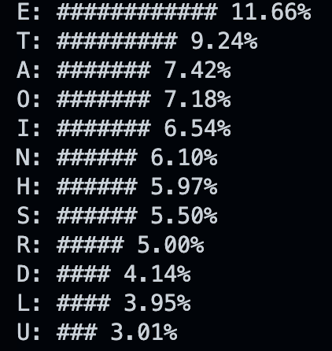

<!-- _backgroundColor: lightgreen -->

# <!-- fit --> 自然語言處理與網路應用

## 謝舒凱 GIL,NTU

## Week6: Introduction to Web programming

---

# 今天主題

- 第一份作業
- CSS 複習與進階
- JavaScript 簡介

---

## 分享與討論

Chinese NLP pipeline via `Streamlit`

---

# CSS


---

## 以上次的課堂作業「台大校歌字卡」為例

相信大家回去都有研究過 CSS 的語法，今天我們來複習一下 CSS 的語法，並且介紹一些進階的語法。

<!-- 佑寬https://htmlpreview.github.io/?https://github.com/Eskartur/nlpWebClass/blob/main/anthem/main.html -->

- 先開啟本週的 web02 資料夾中的 `ntu.html`。

---

## 考一下大家

- `div` 和 `span` 有什麼不同？ (also: _block_ and _inline_ elements)
<!-- https://stackoverflow.com/questions/183532/what-is-the-difference-between-html-div-and-span-elements -->

- `class` 和 `id` 有什麼不同？

---

## 上次提到的 [The Box Model](https://www.w3schools.com/css/css_boxmodel.asp)

- CSS 的盒模型是一種將 HTML (區塊)元素 ('block') (e.g., `div`, `p`)看成一個盒子的模型，這個盒子由四個部分所組成：**margin、border、padding、content**。


- 這個模型可以讓我們更好地控制網頁的外觀。我們來重新改一下上次的校歌字卡。

---

## Exercise.1

調整一下 `margin`、`padding`、`border` 的數值，看看會發生什麼事情。(請在 `style.css` 裡面修改，統一用本週的 `ntu.html` 樣板)

```css
.card {
  margin: 0px;
  padding: 0px;
  border: 0px; /* border: 2px solid black; */
}
```

---

有了不錯的校歌卡，接下來讓我們來添加一些不同的語言版本。先來改一下 `button` 的樣式。
我們想要至少有提供三種語言版本的校歌字卡。
進階一點的話，我們可以讓使用者自行選擇語言版本。

---

## Style the button

- 這裡我們可以使用 `:hover` 來改變 `button` 的樣式。

```css
button:hover {
  background-color: #4caf50;
  color: white;
}
```

---

## Contrast check

- 選擇背景與字體的顏色時，可以考慮對比的問題。
- 可以使用 [Contrast Checker](https://webaim.org/resources/contrastchecker/) 來檢查我們的網頁是否有達到 WCAG 2.0 的規範。(較強的對比，對於有些色盲的人來說，會更好閱讀！)

---

# Flexbox

- Flexbox 是一種 CSS 的排版方式，可以讓我們更容易地排版網頁。

- 在 `style.css` 中，我們可以使用 `display: flex;` 來讓我們的元素變成 flexbox。

```css
.main {
  display: flex;
}
```

---

## Flexbox

- 用 [Flexbox Froggy](https://flexboxfroggy.com/) 的遊戲來入門。

---

# 先介紹一下 Web Devtool

"我也想當校長 😄"

- 在[這裡](https://www.ntu.edu.tw/spotlight/2022/2096_20221007.html)，Chrome 按右鍵，選擇「檢查」(`inspect`)（最左上角的箭號圖示按下去，方便查找）

  - 改成你的名字。（按兩下）
  - 改成你的照片。（知道怎麼找到[原圖片](2096_20221007_1.jpg)放哪裡嗎？）
  - 改一下 `Style`


---

# Interactive web with JavaScript

- JavaScript 是一種網頁互動的語言，可以讓我們在網頁上做一些互動的事情。

- JavaScript 有很多種，這裡我們使用的是 [ECMAScript](https://www.ecma-international.org/publications-and-standards/standards/ecma-262/)。


---

## 執行環境 (1): Devtool

- 簡單的探索方式，先在 Chrome 打開 `ntu.html` （或任一個網頁），右鍵 【檢查】(inspect)， 找到 `console`，就可以輸入 JS code 了。（在 `dockside` 選擇視窗配置）

```JavaScript
console.log("Hello");
```

---

## 執行環境 (2):

- 在 `ntu.html` (`<body>...</body`>) 之間，加入

```html
<script>
  document.getElementById("lyrics").innerText = "Hello";
</script>
```

- 這樣就可以在網頁上看到 `Hello` 了。

- 較好的方式，一樣是 create a `ntu.js` file in `web02` folder，然後在 `ntu.html` 中加入

```html
<script src="ntu.js"></script>
```

---

## 執行環境 (3): Node.js

- Node.js 是一個 JavaScript 的執行環境，可以讓我們在本地端電腦上執行 JavaScript。
- Install Node.js: https://nodejs.org/en/download/
  - 我們可以在終端機中執行 `node` 來進入 Node.js 的環境。
  - (VS code extension `Code Runner`)

---

## JavaScript Syntax

- 要在兩週內速成。還好大家有 python 基礎。想比較的話，參考
  [JavaScript for Python Programmers](https://runestone.academy/ns/books/published/JS4Python/index.html)

- 兩個部分：The Javascript **Fundamentals** and The Javascript in the **Browser** (BOM, DOM, Events)

---

# Quick Tour of JavaScript

我們先用這支程式(`tour.js`)來簡單介紹一下 JavaScript 的基礎語法 。

已學過的同學，可以直接挑戰本週課堂作業。

---

有了梗概，可用 w3schools 的[JS Tutorial](https://www.w3schools.com/js/default.asp) 基礎單元來細部練習。（可貼在 Vscode 來練習更改），搭配[這個](https://javascript.info/)來學習 JavaScript。

<!-- ---

## String and Number

```JavaScript
console.log(4 + 4)       // 8
console.log("4" + "4")   // 44
console.log("4" + 1)     // 41
console.log(400 + "400") // 400400

``` -->

---

# 下週討論瀏覽器裡的 JavaScript

- 瀏覽器都會包含一個 render 引擎，例如 Chrome 的 V8 引擎，這個引擎負責解釋網頁上的程式碼。JavaScript 的解譯器就是這個引擎的一部分。

- 嚴格說，JS (ECMAScript 標準) 並未提供網頁的操作方式，我們需要利用瀏覽器提供的 `BOM` (Browser Object Model), `DOM` (Document Object Model)。（所以在 node 環境下的 JS 沒有這兩個部分）。

---

# 之前稍微碰到的 DOM

- Document Object Model 的縮寫，是一種網頁的結構。
- 我們可以使用 JavaScript 來操作 DOM。
- 這裡我們可以使用 `document.getElementById()` 來取得我們想要的元素。

```JavaScript
document.getElementById("lyrics"); // 取得 id 為 lyrics 的元素
```

- 這裡我們可以使用 `innerText` 來取得或設定元素的文字。

```JavaScript
document.getElementById("lyrics").innerText; // 取得 id 為 lyrics 的元素的文字
document.getElementById("lyrics").innerText = "Hello"; // 設定 id 為 lyrics 的元素的文字為 Hello
```

---

- 這裡我們可以使用 `document.getElementsByClassName()` 來取得我們想要的元素。

```JavaScript
document.getElementsByClassName("lyrics"); // 取得 class 為 lyrics 的元素
```

---

# 回家練習

- 把 fundamentals 的部分弄懂。

- 給定一個英文文本，如何實作 **Character Frequency**？（可用 `charfreq.js` 範例程式來驗收自己的基礎（試著自己先想想演算程序）。

```bash
> node charfreq.js < alice.txt
```



---

## 挑戰型課堂作業

回到台大校歌，我們想要

- 某個按鈕唱出校歌。

```html
<button id="increment-btn" onclick="singOut()">唱出來！</button>
```

- 按某個按鈕做校歌斷詞 (via [`JiebaJS`](https://github.com/pulipulichen/jieba-js))

- 設計語言選單，執行後可把校歌翻譯成該語言。（參考下頁，要申請 api）

---

```javascript
var translate = require("google-translate-api");
translate("我說英語", { to: "en" })
  .then((res) => {
    console.log(res.text);
    //=> 我說英語
    console.log(res.from.language.iso);
    //=> en
  })
  .catch((err) => {
    console.error(err);
  });
```
