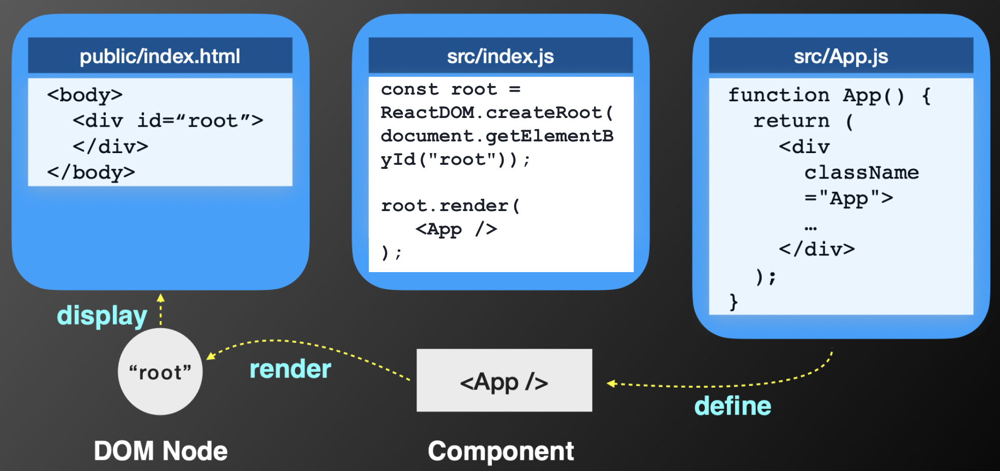
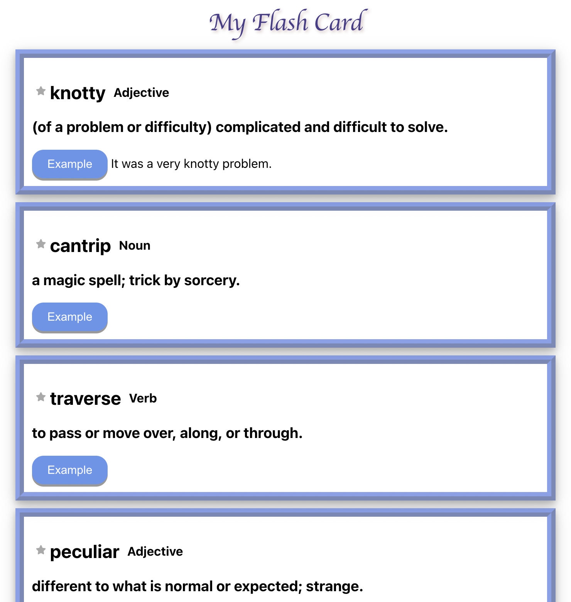

<style>
  header { 
    position: absolute; 
    left: 1000px;
  }
</style>

# Week 8: 初探 React


## 謝心默

---
# 在進入 React 之前，我們先來了解一下 ES
- ECMAScript 6 (ES6) 是 JavaScript 語言新一代的標準
- 發佈於 2015，因此也叫 ES2015 
- 是 JavaScript 最重大改變的一個版本

---
# `const` & `let` 
- `var` 是 **function** scope
- `const` & `let` 是 **block** scope
  > 變數的作用範圍只存在 `{ }` 中
- `let` 和 `const` 宣告的變數一樣會被 hoist 提升到 scope 的最上方，但和 var 不一樣的是，在變數宣告之前存取變數會造成 ReferenceError 錯誤

---
# arrow function
```javascript
const f = (a, b) => a * b;

// is equivalent to
function f(a, b) {
  return a * b;
}
```

---
# Spread/Rest operator `...`
  ```javascript
  function foo(a, b, c, d, e) {
    console.log(a, b, c, d, e);
  }
  var arr = [3, 4];
  foo(1, 2, ...arr, 5);
  ```
  ```javascript
  ary1 = [...ary2, ...ary1];
  ```
  ```javascript
  function fun1(...myArgs) {
    console.log(myArgs);
  }

  fun1(); // []
  fun1(1); // [1]
  fun1(5, 6, 7); // [5, 6, 7]
  ```

---
# Array/object destructing
- array destructing
  ```javascript
  const arr = ["apple", "banana"];
  const [a, b] = arr;
  ```
- object destructing
  ```javascript
  const obj = { fruitOne: "apple", fruitTwo: "banana" };
  const { fruitOne: a , fruitTwo: b  } = obj;
  ```
- default value
  ```javascript
  const [a = 5, b = 7] = [1];
  ```
- 搭配 Rest operator
  ```javascript
  const [a, ...b] = [1, 2, 3];
  ```

---
# Template literals
- 多行字串 (multi-line strings)
  ```javascript
  const str = `first line
  second line`;
  ```
- 在字串中插入變數或 JavaScript 表達式 (String/Expression interpolation)
  ```javascript
  const age = 23;
  function getName() {
    return "Alice";
  }

  console.log(`My name is ${getName()}. I'm ${age > 18? 18 : age} years old.`)
  ```

---
# Promise


- [source](https://www.freecodecamp.org/news/javascript-es6-promises-for-beginners-resolve-reject-and-chaining-explained/)

---
# Promise
```js
const myPromise = new Promise((resolve, reject) => {  
  let condition;  
  
  if(condition is met) {    
      resolve('Promise is resolved successfully.');  
  } else {    
      reject('Promise is rejected');  
  }
});
```
```js
myPromise.then((message) => { 
  console.log(message);
}).catch((error) => { 
  console.log(error);
});
```

---
# 使用 module 分檔 (`import` & `export`)
  ```javascript
  export var firstName = "Michael";
  export function multiply(x, y) { return x * y; } as MUL;
  export class MyClass extends React.Component{...};
  ```
  ```javascript
  // from 後面的 path 可以是絕對或是相對位址
  import { foo } from './myApp.js'; 
  import { add, sub } from '/math/utils/myCalculator.js'; 
  import { aVeryLongName as someName } from '../someFile'; // .js 可省略
  ```
  > require: node 和 ES6 都支援
    export / import: 只有 ES6 支援
    module.exports / exports: 只有 node 支援
---    
# 使用 module 分檔 (`import` & `export`)
- 在前面的例子當中，import 進來的檔案裡的那些 variable、function、class 須跟原檔案裡定義的名稱一樣，且 import 時要加 `{ }`
- **`export default`** 則讓我們可以不用管原來檔案裡頭這些 function/class 叫什麼名字，甚至是可以 anonymous
  ```javascript
  // myMath.js
  export default (a, b) => a + b;

  // index.js
  import myAdd from myMath; // myAdd 可以是任意名稱
  ```
  - export 的檔案只能有一個 `export default` 的 function or class
  - 在 import 時的名字只屬於 import 那個檔案的 scope， 且不可以加 `{ }`

--- 
# class
- 語法糖 syntax sugar
- => 只是讓你更方便操作 JavaScript 既有的**原型繼承**模型 (prototype-based inheritance model)
- `extends`: 類別繼承
- `super`: 如果子類別 (sub-class) 有定義自己的 constructor，必須在 constructor method 中 call `super()`，來調用父類別的 constructor
  - 且必須先執行完 `super()` 後，才能引用 `this`

---
# What is React?

- A JavaScript **library** for building user interfaces.
  > - framework vs library
  > - React 只是 **V** (views) => 只安裝 React 相關套件是不能運作一個完整的前端該有的流程
  > - 但它有一整套相依的生態系
- 目前由 Facebook 以及 reactjs.org 維護
- Single-Page Application (SPA)
- Virtual DOM -> 當 Component 狀態改變時會自動更新
- [React Native](https://reactnative.dev/) (for Android and IOS development)

---
# Single-Page Application (**SPA**)


---

# 來看個例子（工商時間 XD）

> https://rating.myntu.me/

---

# 安裝

- 之前應該已經有安裝過 Node.js 和 NPM 了(?
  - Node >= 14.0.0, npm >= 5.6
- (建議) `$ npm install yarn`
---

# 第一隻程式

```
$ npx create-react-app hello-world
or
$ yarn create react-app hello-world
```

### create-react-app (CRA) 在做什麼？

```
$ npm init projectName
$ npm install // Babel, webpack, ESLint, etc.,
```
> prepare all scripts for you to run React Apps

---


# Folder Structure

```
hello-world/
  README.md
  node_modules/ # 各種相依套件
  package.json # app 的各種資訊 & 相依套件的版本
  public/
    index.html # 網頁模版
    favicon.ico
  src/ # 你的 source code
    App.css 
    App.js # 你的 app
    App.test.js
    index.css 
    index.js # JavaScript 進入點
    logo.svg
```
---


---
# 執行
```
$ cd hello-world

$ npm start (or $ yarn start)
```

---
# 試著改改 code
- 刪掉 7-20 行，改成 `<h1>Hello, world!</h1>`
- 直接在 src/index.js 把 <App /> 改成 `<h1>Hello, wooooorld!</h1>`
> 觀察：存檔之後網頁會自動更新

---
# 也可以改成 React class 的寫法
```javascript
import React from 'react';

class App extends React.Component {
  ...
  render() {
    return <h1>Hello, world!</h1>;
  }
}
```

---
# React 是 Component-based

> 把網頁的 DOM 想成一個個的 components， 用 **JSX** 的語法把每個 component 寫成一個 React element，然後利用 React DOM 的 **render()** method 把 React element 畫到 index.html 對應的節點上面

--- 
# JSX (JavaScript XML)

- `const element = <h1>Hello, world!</h1>;`
- 用 JavaScript 寫像 HTML 的 DOM node
- JSX elements 會被轉譯器轉譯成 JavaScript
- 可以用 `{}` 放任何合法的 JavaScript expression
  ```javascript
  const e1 = <h1> I am a {function(x)} </h1>;
  const e2 = ;
  const e3 = (
    <div>
      <h1>Hello!</h1>
      <h2>Good to see you here.</h2>
    </div>
  );
  const e4 = (user == "Alice" ? <h1>Hello, {user}!</h1>; <h1> Hello, stranger!</h1>);
  ```
- 一個 JSX Element 代表一個 DOM Element
- not required but very useful

---
# 錯誤寫法
- 不能回傳並列的 elements => 只能有一個 root element
  ```javascript
  // wrong
  render() {  
    return (
      <h1>Hello</h1>
      <button>World</button>
    );
  ```
  ```javascript
  // correct
  render() {
    return (
      <div>
        <h1>Hello</h1>
        <button>World</button>
      </div>
    )
  }
  ```

---
# 如果你堅持不想要多一個 root element...
```javascript
render() {
  return (
    <React.Fragment>
      <div>Hello</div>
      <div>World</div>
    </React.Fragment>
  )
}
```
或是
```javascript
render() {
  return (
    <>
      <div>Hello</div>
      <div>World</div>
    </>
  )
}
```
---
# 另一個常用到的地方
```javascript
class Table extends React.Component {
  render() {
    return (
      <table>
        <tr>
          <Columns />
        </tr>
      </table>
    );
  }
}

class Columns extends React.Component {
  render() {
    return (
      <>
        <td>Hello</td>
        <td>World</td>
      </>
    );
  }
}
```

---
# 指定 JSX tag 裏頭 attribute 的值
- React DOM uses **camelCase property naming convention** instead of HTML attribute names.
  - `class` -> `className`
  - `for` -> `htmlFor`
  - `tableindex` -> `tableIndex`

> 參考[這裡](https://reactjs.org/docs/dom-elements.html)

---

#  Virtual DOM
- JavaScript 操作 DOM 很慢
- React 只重新 render 被改動的地方 => 大幅提升畫面更新的速度
> - 在 render DOM 之前，會先為目前的 React Element（ReactDOM.render 的第一個參數）建立一個快照（snapshot）
> - 以 JavaScript 樹狀結構去仿造 DOM
> - 如果並非第一次觸發 render 的話，React 就會比較這次的 Virtual DOM 與上次的 Virtual DOM 的差異（Diff 演算法），並且只會把有差異的部分更新到 DOM 上
--- 

# 舉個例子🌰
- 把 `index.js` 改成如下，點開 devtools 觀察
  ```javascript
  function tick() {
    const element = (
      <div>
        <h1>Hello, world!</h1>
        <h2>It is 
          {new Date().toLocaleTimeString()}.
        </h2>
      </div>
    );
    const root = ReactDOM.createRoot(document.getElementById("root"));
    root.render(element);
  }
  setInterval(tick, 1000);
  ```
>  通常一個 React app 只會呼叫一次 ReactDOM.render() 而已
---
# 應該會看到這樣:


---
# 來看看 React Component
- 設計 UI 畫面時，可以將頁面看做是由一個個小元件與區塊堆疊起來的一個大元件
- 常常有些功能/元件很常重複用到（e.g. 按鈕、選單)
- 優點：
  - reusable -> 開發效率提高
  - 不同 components 之間的邏輯是互不相關的

---
# component & `props`
1. function component 
    ```javascript
    function Welcome(props) {
      return <h1>Hello, {props.name}</h1>;
    }
    ```
2. class component
    ```javascript
    class Welcome extends React.Component {
      render() {
        return <h1>Hello, {this.props.name}</h1>;
      }
    }
    ```

---
# render component
```javascript
const root = ReactDOM.createRoot(document.getElementById('root'));
const element = <Welcome name="Sara" />; 
root.render(element);
```
> React element v.s. React component
> - React element 代表實際畫面上的元件，是一個用來模擬 DOM element 的 JavaScript object，且是 React render 時需要的參數
> - React component 則代表一個元件的藍圖，可以想成是自定義的 HTML tag name，會是一個 function 或是 class。執行後的 React component 才會產出 React element。

---
# 堆疊 component
```javascript
function App() {
  return (
    <div>
      <Welcome name="Monica" />
      <Welcome name="Ben" />
    </div>
  );
}
```

--- 
### 如果要傳的不是字串？
```javascript
function AplusB(props) {
  if (props.flag)
    return <h1> {props.a} + {props.b} = {props.a + props.b}</h1>;
  else 
    return <h1>404</h1>;
}

function App() {
  return <AplusB a={2} b={3} flag={true} />;
}
```

--- 
# props.children
- 代表 JSX element 的子 element
    ```javascript
    function Welcome(props) {
      return <h1>Hello, {props.children}</h1>;
    }

    const element = (
      <Welcome>
        <span>Sara</span>  // <===
      </Welcome>
    );

    const root = ReactDOM.createRoot(document.getElementById("root"));
    root.render(element); // <h1>Hello, <span>Sara</span>
    ```
--- 
# `props` 另一種傳入的方法: `{ }`
```js
function AplusB({a, b, flag}) {
  if (flag)
    return <h1> {a} + {b} = {a+b}</h1>;
  else 
    return <h1>404</h1>;
}

function App() {
  return <AplusB a={2} b={3} flag={true} />;
}
```

---
# ❗️❗️Props are Read-Only❗️❗️

- ### ❌ `this.props.name = "..."`

## > 那如果我有需要更改參數怎麼辦？？
### ➡️ 下週的 `State` !!

---
# 再說一次
- React Component 代表一個自定義元件的藍圖，可以用 function 或是 class 宣告，傳入名為 `props` 的參數，並回傳一個 React Element
- ❌ 不可以更改 `props`


---
# 幾個重要的點 .
- 一個 React project 通常只會有一個 App component 作為 root element
- 所有 .js 和 .css 都應該被放在 **src** 底下 (otherwise webpack won’t see them)
- Only files inside **public** can be used from **public/index.html**
- ❗️React Component 名稱一定要用大寫開頭

---
# ESLint + Prettier
- npm
```properties
npm install eslint --save-dev
npx eslint --init
```
- yarn
```properties
yarn add eslint --dev 
yarn run eslint --init
```
> 請參考[這篇](https://medium.com/how-to-react/config-eslint-and-prettier-in-visual-studio-code-for-react-js-development-97bb2236b31a)

--- 
# 跑了 ESLint 之後，有 `props` 的地方應該會出現 error
```bash
ERROR in [eslint] 
src/components/MyComponent.js
Line 6:35:  'name' is missing in props validation      react/prop-types
Line 9:21:  'age' is missing in props validation      react/prop-types
```

---
# 請加入以下的 code
```js
MyComponent.propTypes = {
  name: PropTypes.string.isRequired,
  age: PropTypes.number,
}
```
或是也可以使用預設值
```js
MyComponent.defaultProps = {
  name: "Stranger"
};
```
> 有哪些 propTypes 可以參考[這裡](https://reactjs.org/docs/typechecking-with-proptypes.html)

---
# 一些不錯的 packages
- Chrome 套件: [React Developer Tools](https://chrome.google.com/webstore/detail/react-developer-tools/fmkadmapgofadopljbjfkapdkoienihi)
- VS Code 套件: [Auto Rename Tag](https://marketplace.visualstudio.com/items?itemName=formulahendry.auto-rename-tag)

---
# 課堂 / 回家作業


- 請用 React 實作一個 flash card app
- 需要有標題、字卡、單字、詞性、意思
- 點星星會變色
- 點例句按鈕會顯示例句
- 盡量讓它長得好看
- 請先用 js 原生修改 DOM 的方式（先不要加入 State）
- 請先不要用外面的套件（Icon 可以）

---
# Steps
- 把 github 上面的 `/lab/flashcard` pull 下來
- 在 `/src` 裡面會有 `containers` 和 `components`，也可以自己新增
- 統一在 `/public/styles.css` 加入style


---
# References

- Ric's Web Programming Class Slides
- https://reactjs.org/docs/getting-started.html
- https://ithelp.ithome.com.tw/users/20107790/ironman/3338
- https://ithelp.ithome.com.tw/users/20116826/ironman/2278
- https://www.fooish.com/javascript/ES6/
- https://ithelp.ithome.com.tw/articles/10160709
- https://segmentfault.com/a/1190000010426778
- https://medium.com/how-to-react/config-eslint-and-prettier-in-visual-studio-code-for-react-js-development-97bb2236b31a
